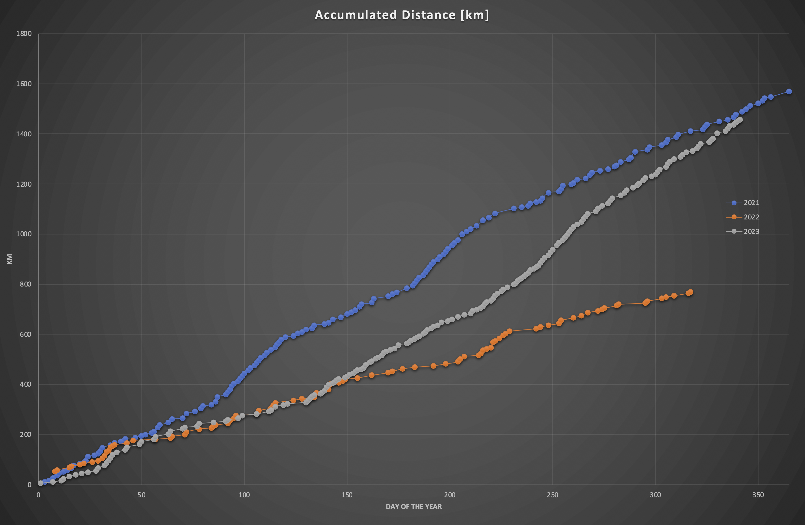
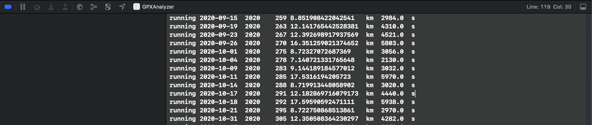

# GPXAnalyzer
Analyze GPX files exported from Strava (or others)

I like running and MTB, and being and engineer, I also like to analyze and visualize the data.

To bulk export your data from Strava refer to

https://support.strava.com/hc/en-us/articles/216918437-Exporting-your-Data-and-Bulk-Export#h_01GG58HC4F1BGQ9PQZZVANN6WF

The bulk export is buried inside Download or Delete Your Account which sounds kind of scary, but works fine.

The exported data should have a file structure like the following:

```
export_XXXXX
├── activities
├── clubs
├── media
└── routes
```

Inside the activities folder you will have all your GPX routes
```
...
6281806556.gpx
6289590445.gpx
6314478044.gpx
6329145080.gpx
6340842081.gpx
...
```

This is the folder that GPXAnalyzer will processs.

### 2024-01-08

The APP currently just provides a button for you to select a folder with the GPX files.
It reads all the GPX files and dumps a sorted list, tab delimited, with the following sample information.
Note: The data is actually tab delimited, I just made it a sliglty prettier here for easier reading

```
Created collection for cycling with 20 files for year 2018
Created collection for cycling with 8 files for year 2017
Created collection for cycling with 28 files
Created collection for running with 2 files for year 2018
Created collection for running with 2 files

       Activity Type    Date          Year    Day of The Year    Accumulated Distance in km    Total Distance in km    Total time in seconds
────┬───────────────────────────────────────────────────────────────────────────────────────────────────────────────────────────────────────────┬────────────────────────────────
1   │  cycling          2017-09-17    2017    260                26.181919318422622            26.181919318422622      8249.0                   │
2   │  cycling          2017-10-15    2017    288                52.10467013031629             25.92275081189367       8690.0                   │
3   │  cycling          2017-10-22    2017    295                77.99900196135494             25.89433183103864       9116.0                   │
4   │  cycling          2017-11-12    2017    316                100.6071559426813             22.60815398132637       5995.0                   │
5   │  cycling          2017-11-19    2017    323                125.99473867599268            25.387582733311373      8774.0                   │
6   │  cycling          2017-11-19    2017    323                125.99473867599268            0.0                     0.0                      │
7   │  cycling          2017-11-26    2017    330                159.12447225085225            33.129733574859586      11275.0                  │
8   │  cycling          2017-12-17    2017    351                182.28994762475583            23.165475373903575      8409.0                   │
9   │  cycling          2018-01-21    2018    21                 31.61447014077056             31.61447014077056       11674.0                  │
10  │  cycling          2018-02-18    2018    49                 60.539844686853165            28.925374546082605      10552.0                  │
11  │  cycling          2018-02-25    2018    56                 87.67907357241337             27.139228885560204      11509.0                  │
12  │  cycling          2018-03-04    2018    63                 113.7337547658952             26.054681193481827      10285.0                  │
13  │  cycling          2018-03-18    2018    77                 143.15967937879458            29.425924612899387      9947.0                   │
14  │  cycling          2018-04-08    2018    98                 169.22170978624385            26.06203040744927       9788.0                   │
15  │  cycling          2018-04-15    2018    105                183.65556729287857            14.433857506634718      6333.0                   │
16  │  cycling          2018-05-31    2018    151                210.33574504410998            26.6801777512314        10906.0                  │
17  │  cycling          2018-06-03    2018    154                232.26428076198295            21.928535717872975      6279.0                   │
18  │  cycling          2018-06-17    2018    168                252.41869049303168            20.154409731048734      7051.0                   │
19  │  cycling          2018-06-24    2018    175                278.6959417313891             26.277251238357433      10370.0                  │
20  │  cycling          2018-07-01    2018    182                314.24504691398056            35.54910518259148       12383.0                  │
21  │  cycling          2018-07-08    2018    189                341.20461128848626            26.959564374505717      11474.0                  │
22  │  cycling          2018-07-22    2018    203                363.209123845473              22.004512556986747      7659.0                   │
23  │  cycling          2018-07-26    2018    207                373.12699284256627            9.917868997093267       3671.0                   │
24  │  cycling          2018-07-29    2018    210                400.3652361234058             27.23824328083951       12592.0                  │
25  │  cycling          2018-08-03    2018    215                419.3455909522025             18.9803548287967        6240.0                   │
26  │  cycling          2018-09-23    2018    266                445.41403607129115            26.068445119088647      9759.0                   │
27  │  cycling          2018-09-30    2018    273                470.78524424541143            25.37120817412028       9876.0                   │
28  │  cycling          2018-10-07    2018    280                487.9409231405569             17.15567889514547       6285.0                   │
29  │  running          2018-08-12    2018    224                5.953243010328043             5.953243010328043       1940.0                   │
30  │  running          2018-08-15    2018    227                16.679654604175006            10.726411593846963      4192.0                   │
    │                                                                                                                                           │
    │                                                                                                                                           │
```

You can then copy the xcode console data and in Excel use paste special, text and the data will be available
for some charting

With some quick copy and paste I was able to look at my accumulated running distance comparisons.
After a slow 2021, I "woke up" late in 2023 to try and beat 2021. I did not have all the data
exported from Strava so 2023 is incomplete (spoiler, I did beat 2021 ;) )


Excel chart using the output of GPXAnalyzer


## Archived updates

### 2024-01-07

The APP currently just provides a button for you to select a folder with the GPX files.
It reads all the GPX files and dumps a sorted list, tab delimited, with the following sample information

```
Activity Type | Date       | Year | Day of The Year | Total Distance in km  | Total time in seconds
--------------|------------|------|-----------------|-----------------------|-----------------------
cycling	      | 2020-05-31 | 2020 | 152             | 25.57511413771457 km  |	9447.0	s
cycling	      | 2020-08-09 | 2020 | 222	            | 25.32350980764099	km  |	8720.0	s
running	      | 2018-08-12 | 2018 | 224             | 5.953241900450686 km  |	1940.0	s
running	      | 2018-08-15 | 2018 | 227	            | 10.726411593846963 km |	4192.0	s
running	      | 2018-11-03 | 2018 | 307	            | 14.751070878509887 km |	6928.0	s
```

You can then copy the xcode console data and in Excel use paste special, text and the data will be available
for some charting



With some quick copy and paste I was able to look at my accumulated running distance comparisons.
After a slow 2021, I "woke up" late in 2023 to try and beat 2021. I did not have all the data
exported from Strava so 2023 is incomplete (spoiler, I did beat 2021 ;) )


Excel chart using the output of GPXAnalyzer


